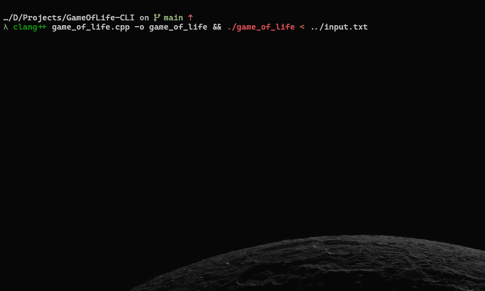

# Conway's Game of Life (C++ Console Version)

This is a simple, text-based implementation of John Conway's Game of Life, written in C++. It runs directly in the terminal and allows the user to define the initial state of the cellular automaton before starting the simulation.



## Features

- **Interactive Setup:** Set the grid dimensions and initial pattern of live cells before starting.
- **Animated Simulation:** Watch the generations evolve in real-time in your console.
- **Stable State Detection:** The simulation automatically stops if a pattern becomes stable (static or oscillating).
- **Cross-Platform:** Uses standard C++ and system calls that work on Windows, macOS, and Linux.

## The Rules of the Game

The universe of the Game of Life is an infinite, two-dimensional orthogonal grid of square cells, each of which is in one of two possible states, "alive" or "dead". The game evolves in discrete time steps (generations) according to a simple set of rules:

1.  A **living cell** with fewer than two live neighbours **dies**, as if by underpopulation.
2.  A **living cell** with two or three live neighbours **survives** to the next generation.
3.  A **living cell** with more than three live neighbours **dies**, as if by overpopulation.
4.  A **dead cell** with exactly three live neighbours **becomes a living cell**, as if by reproduction.

## Requirements

- A C++ compiler that supports the C++11 standard or newer (for `<thread>` and `<chrono>`).
  - **g++** (on Linux/macOS)
  - **Clang** (on macOS/Linux)
  - **MinGW** or **MSVC** (on Windows)

## How to Compile and Run

1.  **Clone or Download:** Get the `game_of_life.cpp` file and place it in a new directory.

2.  **Open a Terminal:** Navigate to the directory where you saved the file.

3.  **Compile the Code:** Use your C++ compiler to create an executable.

    **On Linux or macOS:**

    ```bash
    g++ game_of_life.cpp -o game_of_life
    ```

    _(Note: On some older systems, you might need to add `-lpthread` to link the thread library)._

    **On Windows (with MinGW):**

    ```bash
    g++ game_of_life.cpp -o game_of_life.exe
    ```

4.  **Run the Executable:**

    **On Linux or macOS:**

    ```bash
    ./game_of_life
    ```

    **On Windows:**

    ```bash
    game_of_life.exe
    ```

## How to Use

Once you run the program, it will guide you through the setup process:

1.  First, it will ask you for the **width** and **height** of the grid.
2.  Next, it will prompt you to enter the coordinates of the initial live cells.
    - Enter coordinates as `row col` (e.g., `5 10`).
    - The coordinate system is 0-indexed, meaning the top-left cell is `0 0`.
    - After each entry, the grid will be redrawn to show your pattern.
3.  When you are finished setting up your pattern, enter `-1 -1` to start the simulation.

### Example: Creating a "Glider"

A "Glider" is a simple pattern that moves across the grid. To create one on a 20x20 grid:

1.  Enter `20` for the width and `20` for the height.
2.  Enter the following coordinates, one pair at a time:
    - `1 2`
    - `2 3`
    - `3 1`
    - `3 2`
    - `3 3`
3.  Enter `-1 -1` to start. You will see the glider "fly" diagonally across the console.

To stop the simulation manually at any time, press `Ctrl+C`.
